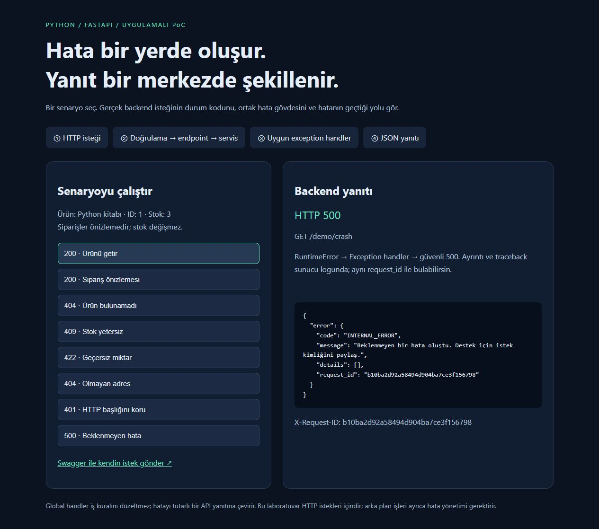
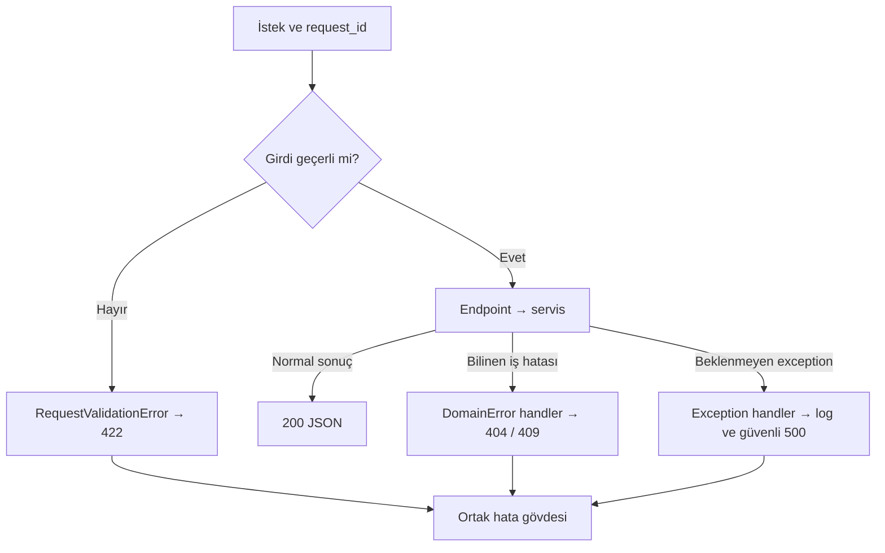

# Python ile Global Error Handling PoC

Global error handling, HTTP isteği işlenirken oluşan hataları merkezi bir yerde sınıflandırıp tutarlı yanıtlara dönüştürür. İş kuralları serviste kalır; HTTP durum kodu ve yanıt biçimi handler katmanındadır.

Python / FastAPI ile hazırlanmış bu eğitim laboratuvarında butonlarla gerçek API istekleri gönderilir. Başarılı yanıtlar, iş kuralı hataları, doğrulama hataları ve beklenmeyen sunucu hataları karşılaştırılır.



## Global error handling nerede?

Merkez **[app/errors.py](app/errors.py)** dosyasındaki `register_handlers(app)` fonksiyonudur. **[app/main.py](app/main.py)** içindeki `register_handlers(app)` çağrısı handler'ları uygulamaya kaydeder.

| Handler | Sorumluluk | HTTP kodu |
|---|---|---|
| `domain_handler` | Ürün bulunamadı ve yetersiz stok gibi bilinen iş hataları | 404 / 409 |
| `validation_handler` | İstek alanlarının doğrulanması | 422 |
| `http_handler` | Framework HTTP hataları; 404, 405 ve yetkisiz istek demosu | Hatanın HTTP kodu |
| `unexpected_handler` | Diğer handler'ların karşılamadığı exception'lar | 500 |

```text
GET /products/999
  → main.py: endpoint
  → domain.py: servis
  → repository.py: ürün bulunamaz, None döner
  → domain.py: raise ProductNotFound(...)
  → errors.py: domain_handler(...)
  → HTTP 404 + standart JSON hata yanıtı
```

## Klasör ve dosya yapısı

```text
global-error-poc/
├── app/                  # Çalışan backend ve deney ekranı
│   ├── __init__.py       # Python paketi
│   ├── main.py           # FastAPI kurulumu, endpoint'ler, request_id
│   ├── domain.py         # İş kuralları ve uygulama exception'ları
│   ├── repository.py     # Sabit veri üzerinde veri erişim katmanı
│   ├── errors.py         # Merkezi exception → HTTP/JSON dönüşümü
│   └── lab.html          # Butonlarla istek gönderen deney ekranı
├── tests/
│   └── test_errors.py    # HTTP davranışını doğrulayan 15 test
├── requirements.txt     # Doğrulanan doğrudan bağımlılık sürümleri
├── README.md            # Kurulum ve öğrenme rehberi
├── VIDEO_ANALIZI.md      # Kaynak videonun analizi ve Python karşılıkları
└── lab-preview.png      # Deney ekranı görüntüsü
```

`.venv/` projeye özel Python ortamıdır; kurulum sırasında oluşur. `__pycache__/` ve `.pytest_cache/` otomatik önbelleklerdir. Bunlar Git'e dahil edilmez.

## Çalıştırma (PowerShell, Python 3.10+)

Bu klasörde terminal aç:

```powershell
python -m venv .venv
.\.venv\Scripts\python.exe -m pip install -r requirements.txt
.\.venv\Scripts\python.exe -m uvicorn app.main:app --host 127.0.0.1 --port 8000
```

Tarayıcıda http://127.0.0.1:8000 adresini aç. Swagger: http://127.0.0.1:8000/docs
Aktivasyon gerekmez. Durdurmak için terminalde Ctrl+C.
Sürümler bu PoC'nin doğrulandığı sürümlerdir; en güncel sürüm iddiası taşımaz.

macOS / Linux için:

```bash
python3 -m venv .venv
.venv/bin/python -m pip install -r requirements.txt
.venv/bin/python -m uvicorn app.main:app --host 127.0.0.1 --port 8000
```

## Terminalden örnek istekler

PowerShell'de başarılı ürün sorgusu:

```powershell
curl.exe -i http://127.0.0.1:8000/products/1
```

Ürün bulunamadı ve beklenmeyen hata:

```powershell
curl.exe -i http://127.0.0.1:8000/products/999
curl.exe -i http://127.0.0.1:8000/demo/crash
```

Stok yetersiz örneği (PowerShell):

```powershell
$body = @{ product_id = 1; quantity = 4 } | ConvertTo-Json
try {
    Invoke-RestMethod -Method Post -Uri http://127.0.0.1:8000/orders/preview -ContentType 'application/json' -Body $body
} catch {
    $_.ErrorDetails.Message
}
```

Son örnekteki `try/catch` terminal istemcisinin HTTP 409 gövdesini göstermesi içindir; backend'in merkezi handler'ından farklıdır.

## Önce bu deneyi yap

1. **200 — Ürünü getir:** normal yanıtı gör.
2. **404 — Ürün bulunamadı:** `domain.py` içindeki `raise ProductNotFound` satırını bul.
3. `main.py` içindeki endpoint'e bak: `try/except` yok. Hata çağrı zinciri boyunca yukarı çıkar.
4. `errors.py` içindeki `domain_handler` hatayı 404 ve `PRODUCT_NOT_FOUND` koduna çevirir.
5. **409 — Stok yetersiz:** aynı merkezi düzen başka bir iş hatasını yönetir.
6. **422 — Geçersiz miktar:** bu kez servis hiç çalışmaz; istek doğrulaması hatayı üretir.
7. **500 — Beklenmeyen hata:** tarayıcıda teknik ayrıntı görünmez. Terminalde traceback ve aynı `request_id` vardır.

## Akış



Bu bir öğretici akış şemasıdır; framework'ün iç middleware sırasının birebir diyagramı değildir. Router kaynaklı 404/405 hataları da HTTPException handler'a gider.

## Hata sözleşmesi

```json
{
  "error": {
    "code": "INSUFFICIENT_STOCK",
    "message": "İstenen miktar stoktan fazla.",
    "details": [],
    "request_id": "sunucunun-urettigi-kimlik"
  }
}
```

- HTTP status istemcinin genel davranışını belirler.
- `code` uygulamanın sabit, makine tarafından okunabilen hata kodudur.
- `message` kullanıcıya gösterilebilen açıklamadır; istemci iş akışını bu metne bağlama.
- `details` doğrulama hatalarında alan ve hata türünü taşır, gönderilen değeri içermez.
- `request_id` yanıt ve sunucu logunu eşleştirir; `X-Request-ID` başlığında da vardır.

| Deney | İstek | Sonuç |
|---|---|---|
| Başarılı | `GET /products/1` | 200 |
| İş nesnesi yok | `GET /products/999` | 404 / PRODUCT_NOT_FOUND |
| Stok 3, miktar 4 | `POST /orders/preview` | 409 / INSUFFICIENT_STOCK |
| Miktar 0 | `POST /orders/preview` | 422 / VALIDATION_ERROR |
| ID sayı değil | `GET /products/abc` | 422 / VALIDATION_ERROR |
| Adres yok | `GET /missing` | 404 / HTTP_404 |
| Yanlış metot | `POST /products/1` | 405 / HTTP_405; Allow korunur |
| Yetkisiz demo | `GET /demo/unauthorized` | 401; WWW-Authenticate korunur |
| Programlama/altyapı hatası | `GET /demo/crash` | 500 / INTERNAL_ERROR |

## Merkezi yakalama neden yararlı?

Her endpoint'te aynı `try/except` bloklarını yazarsan, biri 404 diğeri 500 döndürebilir; mesaj biçimleri de zamanla farklılaşır. Burada servis yalnızca `ProductNotFound` fırlatır. API katmanı bu hatanın HTTP karşılığını bir yerde tanımlar. FastAPI uygun handler'ı exception sınıfına göre seçer; genel `Exception` handler'ı beklenmeyen hatalar için son savunmadır.

Yerel `try/except` yine kullanılabilir: gerçekten toparlanabiliyorsan, kaynak temizliği gerekiyorsa veya bir sağlayıcı hatasını uygulama hatasına çevireceksen. Örneğin sadece bilinen bir sağlayıcı zaman aşımını yakalayıp `raise PaymentUnavailable(...) from exc` kullanabilirsin. Her exception'ı yakalayıp başarı döndürmek hatayı gizler. Global handler otomatik retry veya veritabanı rollback sağlamaz; transaction sınırını ayrıca tasarlamalısın.

## Kod okuma sırası

1. `app/domain.py` — framework'ten bağımsız iş kuralları ve exception türleri.
2. `app/main.py` — endpoint, giriş modeli, request kimliği.
3. `app/errors.py` — merkezi hata sınıflandırma, loglama, JSON yanıtı.
4. `app/repository.py` — sabit veriyi okuyan veri erişim katmanı.
5. `tests/test_errors.py` — dışarıdan gözlenen davranışın testleri.

`@app.middleware("http")` her isteğe kimlik verir. Exception handler ise belirli hatayı yanıta çevirir. Bunlar farklı sorumluluklardır. Starlette'in genel 500 handler'ı kullanıcı middleware'inin dışındaki ServerErrorMiddleware tarafından işletilir; bu yüzden hata yanıtının kimlik başlığını ayrıca `error_response` içinde de koyuyoruz. Framework, yakalanmamış exception'ı yanıtı oluşturduktan sonra sunucu loglaması için yeniden yükseltebilir. TestClient'ta bu yanıtı görebilmek için `raise_server_exceptions=False` kullanıyoruz.

## Test

```powershell
.\.venv\Scripts\python.exe -m pytest -q
```

Testler HTTP kodlarını, ortak gövdeyi, validation detaylarını, gizli hata ayrıntısının istemciye gitmemesini, log korelasyonunu ve gerekli HTTP başlıklarının korunmasını doğrular.

## Sınırlar

Bu PoC'de veritabanı veya gerçek kimlik doğrulama yoktur. Sipariş yalnızca önizlenir, stok düşülmez. `/demo/crash` ve `/demo/unauthorized` eğitim içindir. `debug=False` güvenli 500 yanıtının kullanılmasını sağlar. Loglar gerçek sistemde hassas veri içerebilir; log erişimi ve maskeleme ayrıca tasarlanır. Yanıt başladıktan sonraki streaming/background-task hatalarında yeni JSON yanıtı gönderilemez. WebSocket, worker ve uygulama başlangıç hatalarının ayrı sınırları vardır. OpenAPI ekranı kullanılabilir; özel hata gövdeleri bu küçük PoC'de response modeli olarak ayrıca belgelenmemiştir.

## Kaynaklar

- Kullanıcının video bağlantısı: https://www.youtube.com/watch?v=8NaM_9aKS24
- FastAPI resmi hata yönetimi: https://fastapi.tiangolo.com/tutorial/handling-errors/
- Starlette exception davranışı: https://www.starlette.io/exceptions/

Videonun otomatik altyazısına dayalı inceleme ve zaman bağlantıları [VIDEO_ANALIZI.md](VIDEO_ANALIZI.md) dosyasındadır. Buradaki teknik örnekler, videonun birebir çevirisi değil, Python ile uygulanmış öğretici bir uyarlamasıdır.
